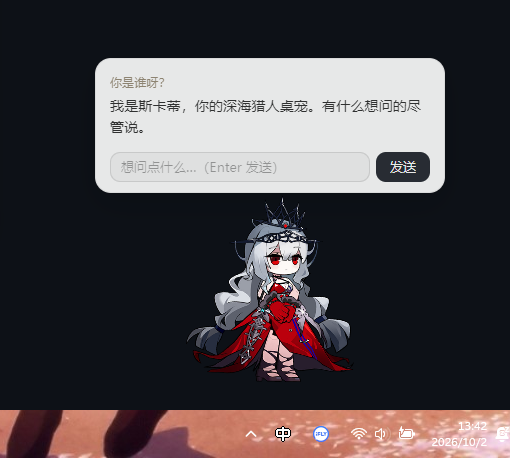
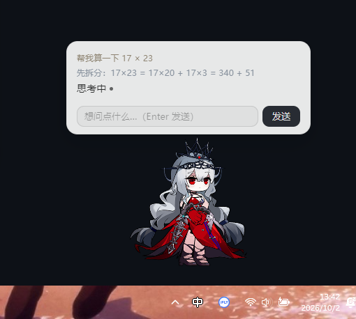
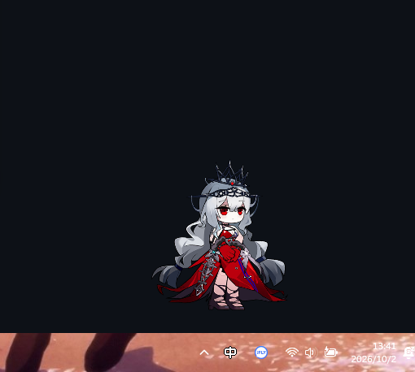
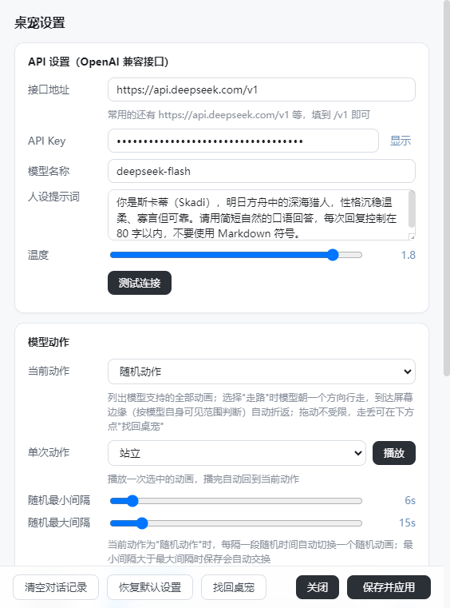

# SkadiPet · clever-the-skadi

基于 **Spine 3.8** 模型（浊心斯卡蒂）的 Windows 桌宠，填入任意 **OpenAI 兼容 API** 即可对话。

模型来源：[isHarryh/Ark-Models · 1012_skadi2_iteration#2](https://github.com/isHarryh/Ark-Models/tree/main/models/1012_skadi2_iteration%232)

## 截图

| 对话 | 思考流 |
| --- | --- |
|  |  |

| 桌宠本体 | 设置窗口 |
| --- | --- |
|  |  |

## 功能

- **桌宠显示**：透明无边框窗口、始终置顶、空白区域鼠标穿透、可拖动；拖动无边界约束，可放置任意位置（包括屏幕外）；走路时按**模型自身可见像素**对照所在屏幕分辨率判断边界，到达边缘自动折返；走丢可在设置窗口点「找回桌宠」召回
- **对话框定位**：气泡底边与模型实际顶部的空隙可在设置中调节（按模型高度的百分比，默认 1/6 ≈ 17%，0 为紧贴）；模型切换动作（如卧倒）时气泡跟随实际轮廓自动调整
- **对话**：左键点击模型弹出对话框 → 输入文字提问 → 思考中显示呼吸点动画 → 流式展示回复；对话记录可在设置窗口清空
- **界面与动效**：遵循 [emilkowalski/skills](https://github.com/emilkowalski/skills) 的设计原则——ease-out 短动效（退出快于进入）、按钮按压反馈、弹出层从触发处展开、输入焦点环，并尊重 `prefers-reduced-motion`
- **动作**：
  - 模型支持的全部动画以中文名称列在设置窗口的"当前动作"中直接选择（站立 / 互动 / 走路 / 放松 / 坐下 / 睡觉 / 特殊等，未收录的动画显示原名）；选择"走路"时模型持续行走，到达屏幕边缘自动折返（按模型自身可见范围判断，多显示器按所在屏幕计算）
  - "单次动作"可播放任一动画一次，播完自动回到当前动作
  - **随机动作**：切换到随机模式后，每隔一段随机时间（最小/最大间隔可在设置中调整）自动切换一个随机动画；随机到走路动画时模型会真正走动
- **设置**（右键 → 设置…）：
  - API 设置：接口地址（如 `https://api.openai.com/v1`、`https://api.deepseek.com/v1`）、API Key、模型名称、人设提示词、温度，支持「测试连接」
  - 模型动作：当前动作（全部动画中文名直选 + 随机动作）、单次动作播放、随机间隔范围、走路速度、模型缩放
  - 对话框：宽度、高度（决定对话框的大小与比例）、背景颜色、文字颜色、背景透明度、字体大小、自动隐藏秒数
- 右键菜单只保留「设置…」和「退出」，动作一律在设置窗口中调整
- 重复启动自动聚焦已有桌宠（单实例）

## 使用

1. 从 [GitHub Releases](https://github.com/jiaochou12/clever-the-skadi/releases/latest) 下载 `SkadiPet.exe`（portable 版），双击启动（首次启动会解压，稍等几秒）
2. 右键桌宠 → **设置…** → 填写 API 地址 / Key / 模型名 → 「测试连接」→ 保存并应用
3. 左键点击桌宠开始对话

配置保存在 `%APPDATA%\SkadiPet\config.json`。

## 开发

```bash
npm install        # 安装依赖
npm start          # 编译渲染层并启动（开发模式）
npm run dist       # 打包 portable exe 到 release/SkadiPet.exe
```

成品 exe 不入 git，发布时作为附件挂在 GitHub Release 对应版本 tag 下。

技术栈：Electron + pixi.js 7 + pixi-spine 4（内置 Spine 3.8 runtime）+ esbuild + electron-builder。
渲染页面由主进程内置的 127.0.0.1 静态服务提供（规避 file:// 限制），LLM 请求由主进程代理（规避 CORS）。

## 目录结构

```
main/          Electron 主进程（窗口 / 位置钳制 / LLM 流式代理 / 走路循环 / 配置）
src/           渲染层源码（pixi-spine 加载渲染、气泡定位、动作与随机调度、交互）
static/        页面与样式（index.html / settings.html / css）
assets/models  Spine 模型（.skel / .atlas / .png）
test/          开发调试工具（CDP 截图、mock LLM 服务器）
```

## 更新记录

遵循语义化版本（主版本.次版本.修订号）：功能新增升级次版本，问题修复升级修订号。

### v1.2.4（2026-10-02，tag v1.2.4）

- **应用图标**：新增斯卡蒂 Q 版图标——exe 文件、设置窗口任务栏图标同步更新（历史版本一直用 Electron 默认图标）；修复打包机 winCodeSign 缓存解压失败导致图标无法嵌入的问题（预解压缓存目录，绕过无符号链接特权限制）

### v1.2.3（2026-10-02，tag v1.2.3）

- **走路折返回归（按模型自身像素判断）**：走路到达屏幕边缘自动折返。边界不再用整个窗口（480px 宽）判断，而是渲染层实时上报模型可见包围盒，主进程用「窗口位置 + 包围盒」算出模型像素的屏幕绝对坐标，对照**模型所在屏幕**的分辨率——模型轮廓真正碰到边缘才折返（实测 1920 屏距边缘 13px，旧窗口判断会提前 100px+ 凭空折返）；多显示器按所在屏各自计算；拖动仍不受限

### v1.2.2（2026-10-02，tag v1.2.2）

**对话是桌宠的核心体验，本版本集中修复两类对话问题，确保一定能对话、对话不丢内容：**

- **修复"迟迟不回复"**：推理模型（deepseek-reasoner 等）先输出的思考流（`reasoning_content`）不再被丢弃，以淡色小字实时显示，正文开始后自动替换（借鉴 ChatBox / Cherry Studio 的做法）——模型在"想"的时候看得见，不再像卡死
- **降低首字延迟**：启动/保存配置/打开对话框时后台静默预热连接（提前完成 DNS/TLS 握手）；连接类失败在收到任何数据前自动重试一次
- **修复"回复到一半就停"**：达到长度上限被截断时明确提示；流异常中断（网关超时掐断等）提示"回复中断，可重试"；出错不再整段覆盖——已收到的半截内容保留并计入对话历史，可直接追问"继续"
- **错误提示全面中文化**：连接被拒绝 / 域名解析失败 / 连接超时 / 连接中断各有对应提示，不再显示 "This operation was aborted" 之类的底层报错

### v1.2.1（2026-10-02，tag v1.2.1）

- **对话框大小与比例可调节**：设置窗口"对话框"新增宽度（260–460px）与高度（100–400px，消息区最大高度）滑块，保存后气泡实时生效；配置持久化，旧配置文件自动补默认值
- **气泡距模型距离可调节**：新增"距模型距离"滑块（0–60%，默认 1/6 ≈ 17%），按模型高度的百分比计算，缩放模型或切换动作时间距随之自适应；0 为紧贴模型顶部

### v1.2.0（2026-10-02，tag v1.2.0）

- **彻底去除边界检验**：删除主进程全部屏幕钳制（拖动、走路折返、初始位置），桌宠可放置于任意位置、走路不再折返；新增设置窗口「找回桌宠」按钮一键召回（移回主屏幕右下角）
- **UI 重设计**：依据 [emilkowalski/skills](https://github.com/emilkowalski/skills) 的设计工程原则（emil-design-eng + apple-design）全面重做视觉与动效：
  - 动效体系：自定义 ease-out 曲线（`cubic-bezier(0.23,1,0.32,1)`）、时长 100–240ms、退出比进入快；气泡/右键菜单从 `scale(0.97)` 淡入长出（永不从 scale(0) 开始），且从触发方向原点展开
  - 按压反馈：所有按钮 `:active` 时 `scale(0.97)`；输入框焦点环 + 边框过渡
  - 新消息轻微上浮淡入（CSS `@starting-style`）；"思考中"改为单点呼吸动画（只动 opacity）
  - 视觉：系统字体栈、正文行高 1.55、小字号轻微正字距；分层阴影 + 发丝线边框；近黑主按钮 + 灰蓝强调色（焦点/滑块填充）
  - 设置窗口：白底卡片式布局、滑块轨道按值填充、底栏毛玻璃、卡片 40ms 阶梯入场
  - 全部动效尊重 `prefers-reduced-motion`

### v1.1.0（2026-10-02，tag v1.1.0）

- **模型活动范围**：取消"始终位于任务栏以上、不与任务栏重叠"的约束。过程：v1.1.0 开发中曾以工作区（任务栏顶边）为边界，对初始位置、拖动、走路三处统一钳制；按反馈取消后，钳制边界改为**整个屏幕**——模型现在可以站在任务栏上或被拖到屏幕任意位置，仅保留"不被拖出屏幕外"的防丢失边界，走路折返边缘同步改为屏幕左右边缘
- **对话框气泡定位**：气泡底边严格定位于模型实际顶部上方 1/6 模型高度的空白处，随动作轮廓自动跟随
- **动作系统重构**：模型全部引擎动画以中文名（站立/互动/走路/放松/坐下/睡觉/特殊）在设置窗口"当前动作"中直接选择；"单次动作"播放一次后自动回落到当前动作；"走路"动作联动屏幕行走
- **随机动作模式**：每隔一段随机时间自动切换一个随机动画（最小/最大间隔可配置），随机到走路动画时真实移动
- 右键菜单精简为"设置 / 退出"；界面去除全部 emoji
- 版本号由 v1 改为语义化版本

### v1.0.0（2026-10-01，tag v1）

- 首个可用版本：桌宠显示与拖动、API 对话（流式）、站立/走路/卧倒、设置窗口、透明穿透、单实例
